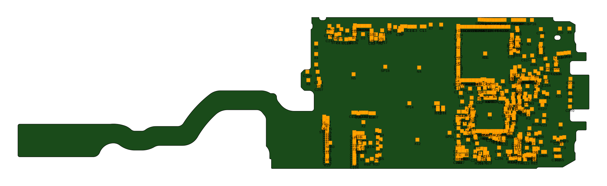
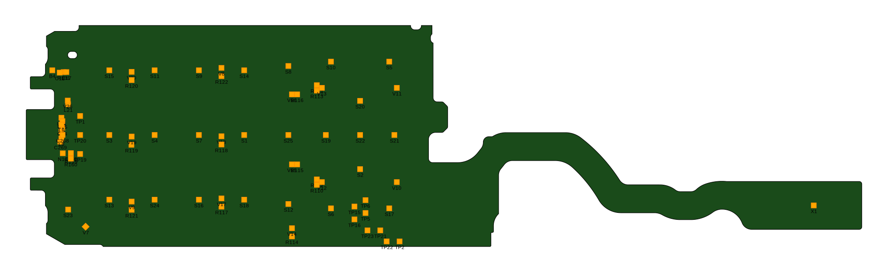

# ODB++ Profile to SVG Converter

This Python script converts ODB++ profile files to SVG format for visualization.

## Features

- Parses ODB++ profile files according to the ODB++ specification
- Supports surface records with polygons (islands and holes)
- Handles both line segments (OS) and arc segments (OC) with correct arc direction
- Generates clean SVG output with proper coordinate transformation (SVG y-down)
- Correctly renders rounded corners and curved board edges
- Supports both positive and negative polarity surfaces
- **Auto-discovery**: Works with an ODB++ directory or `.tgz` archive; finds the first step's `profile` and optional `layers/comp_+_top|bot/components`
- **Dual outputs**: Emits `top.svg` and `bottom.svg`
- **Bottom view mirroring**: Bottom is mirrored left-to-right (over the y-axis) to represent the real-world bottom view; text labels remain readable
- **Component visualization**: Parses and displays component placements with labels
- Automatically calculates bounding box including components and adds padding

## Usage

```bash
python odbpp_profile_to_svg.py <odb_root_or_tgz>
```

Outputs: `top.svg` and `bottom.svg` in the current directory.

### Examples

```bash
# From an ODB++ folder (auto-discovers step/profile and components)
python odbpp_profile_to_svg.py testdata/qorvpr71odbpp

# From an ODB++ .tgz archive
python odbpp_profile_to_svg.py testdata/qorvpr71odbpp.tgz
```

## Supported ODB++ Records

### Surface Records
- `S` - Surface definition with polarity and attributes
- `SE` - Surface end

### Outline Records
- `OB` - Outline begin (start of polygon with type: I=island, H=hole)
- `OS` - Outline segment (line to point)
- `OC` - Outline curve (arc to point with center and direction)
- `OE` - Outline end

### Component Records
- `CMP` - Component definition with position, rotation, and reference designator
- `UNITS` - Units specification (MM or INCH)

### Other Records
- `ID` - Feature identification

## Output

The generated SVG includes:
- Proper coordinate system transformation (Y-axis flipped for SVG)
- Islands rendered as filled shapes
- Holes rendered with `fill-rule="evenodd"` for proper display
- Styled board outline with green fill and black stroke
- **Components rendered as orange rectangles with reference designator labels**
- Component rotation support; labels remain upright/readable even when the whole view is mirrored
- Automatic viewBox calculation for optimal display

## Rendered examples

Top view:



Bottom view (mirrored left-to-right):



## Requirements

- Python 3.6+
- No external dependencies (uses only standard library)

## File Structure

The script expects ODB++ profile files with the following structure:
- Header with units and metadata
- One or more surface definitions
- Each surface containing polygons (islands and holes)
- Polygons defined by line and arc segments